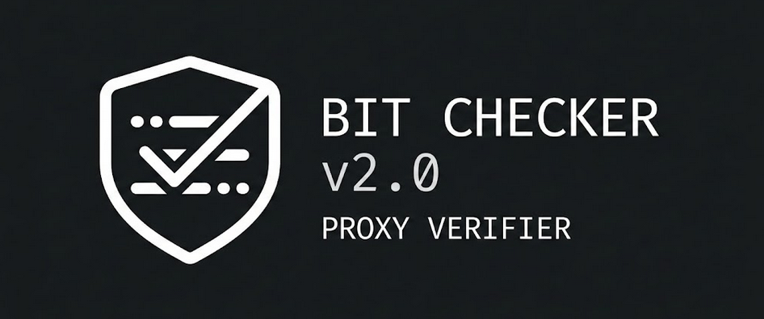

<p align="center">
  
</p>

<h1 align="center">🛡️ Bit Checker v2.0</h1>

<p align="center">
  
  
  
</p>

---

### 📖 Описание
**Bit Checker v2.0** — это высокопроизводительный асинхронный чекер прокси-серверов с современным текстовым интерфейсом (TUI). Забудь про скучные консольные строки: здесь полноценное приложение внутри твоего терминала.

> Программа позволяет мгновенно проверять списки прокси, настраивать параметры «на лету» и автоматически фильтровать рабочие узлы.

---

### ✨ Ключевые фишки

* 🚀 **Асинхронный движок:** Благодаря `aiohttp` и `asyncio` проверка сотен прокси занимает считанные секунды.
* 🖥️ **Продвинутый TUI:** Интерфейс на базе библиотеки `Textual` с кнопками, формами ввода и плавной анимацией.
* ⚙️ **Полный контроль:**
    * **Цель:** Меняй проверочный сайт (Google, Яндекс и др.) без перезагрузки.
    * **Таймаут:** Гибкая настройка ожидания ответа.
    * **Потоки:** Ограничение нагрузки через `asyncio.Semaphore`.
* 📊 **Живой лог:** Интерактивное окно с цветовой индикацией (Live/Dead) и деталями ошибок.
* 💾 **Умное сохранение:** Все валидные прокси моментально улетают в `work.txt`.

---

### 🛠️ Быстрый старт

1. **Установка зависимостей:**
   ```bash
   pip install textual aiohttp

